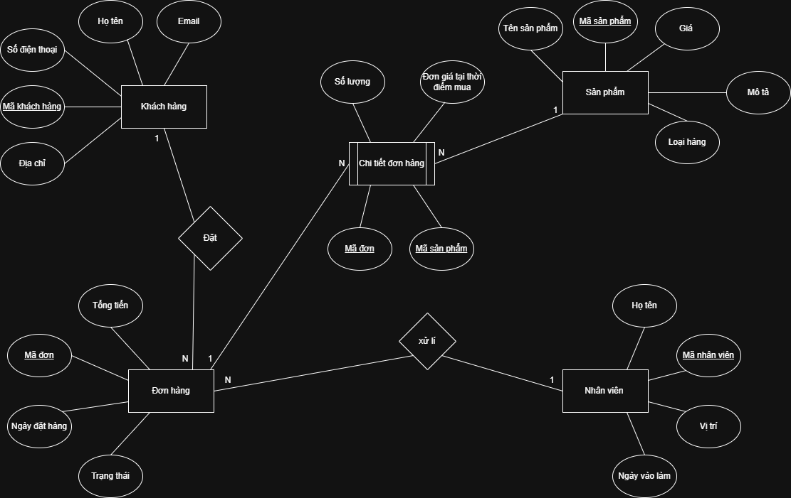

# **Hệ thống quản lý đơn hàng Thương mại điện tử**
## **Mô tả**  
***Một trang web bán hàng trực tuyến cần quản lý thông tin về:**  

Khách hàng (Customer): mã khách hàng, họ tên, email, số điện thoại, địa chỉ  
Sản phẩm (Product): mã sản phẩm, tên sản phẩm, giá, mô tả, loại hàng  
Đơn hàng (Order): mã đơn, ngày đặt hàng, tổng tiền, trạng thái  
Chi tiết đơn hàng (OrderDetail): số lượng, đơn giá tại thời điểm mua  
Nhân viên (Staff): mã nhân viên, họ tên, vị trí, ngày vào làm  

**1. Xác định các thực thể và thuộc tính chính**
**- Thực thể:** Khách hàng (Customer)  
 Thuộc tính: mã khách hàng, họ tên, email, số điện thoại, địa chỉ  
**- Thực thể:** Sản phẩm (Product)  
 Thuộc tính: mã sản phẩm, tên sản phẩm, giá, mô tả, loại hàng
**- Thực thể:** Đơn hàng (Order)  
 Thuộc tính: mã đơn, ngày đặt hàng, tổng tiền, trạng thái  
**- Thực thể:** Chi tiết đơn hàng (OrderDetail)  
 Thuộc tính: số lượng, đơn giá tại thời điểm mua  
**- Thực thể:** Nhân viên (Staff)  
 Thuộc tính: mã nhân viên, họ tên, vị trí, ngày vào làm  

**2. Xác định mối quan hệ giữa các thực thể, ví dụ:**  
a. Khách hàng đặt nhiều đơn hàng: Mối quan hệ 1:N  
b. Một đơn hàng chứa nhiều sản phẩm: Mối quan hệ N:N  
-> Tạo thực thể trung gian: Chi tiết đơn hàng   
c. Nhân viên xử lý đơn hàng: Mối quan hệ 1:N  

**3. Vẽ sơ đồ ERD thể hiện các thực thể, mối quan hệ, và ràng buộc (1–n, n–n)**  

  

**4. Ghi chú khóa chính (PK), khóa ngoại (FK) rõ ràng trong sơ đồ**  
**Khóa chính:** Mã Khách hàng, Mã Sản phẩm, Mã Đơn, Mã Nhân viên  
**Khóa ngoại:**   
- Thực thể Chi tiết đơn hàng: Mã đơn, Mã sản phẩm  
