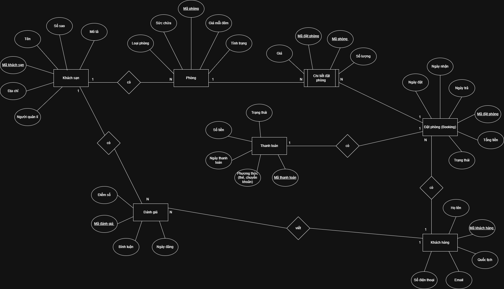

# **Hệ thống Quản lý Đặt phòng Khách sạn**
## **Mô tả**  
***Một hệ thống đặt phòng khách sạn trực tuyến (giống Booking.com) cần quản lý các thông tin sau:**  

**Khách sạn (Hotel):** mã khách sạn, tên, địa chỉ, số sao, mô tả, người quản lý  
**Phòng (Room):** mã phòng, loại phòng (Deluxe, Standard...), giá mỗi đêm, tình trạng (trống, đã đặt), sức chứa  
**Khách hàng (Customer):** mã khách hàng, họ tên, email, số điện thoại, quốc tịch  
**Đặt phòng (Booking):** mã đặt phòng, ngày đặt, ngày nhận, ngày trả, tổng tiền, trạng thái (chờ, xác nhận, hủy)  
**Thanh toán (Payment):** mã thanh toán, phương thức (thẻ, chuyển khoản), ngày thanh toán, số tiền, trạng thái  
**Đánh giá (Review):** mã đánh giá, điểm số, bình luận, ngày đăng  

### **1. Xác định các thực thể và thuộc tính chính, khóa chính, khóa ngoại**  
**- Thực thể:** Khách sạn (Hotel)  
 **Thuộc tính:** mã khách sạn, tên, địa chỉ, số sao, mô tả, người quản lý  
 - Khóa chính: mã khách sạn  

**- Thực thể:** Phòng (Room)  
 **Thuộc tính:** mã phòng, loại phòng (Deluxe, Standard...), giá mỗi đêm, tình trạng (trống, đã đặt), sức chứa  
 - Khóa chính: mã phòng  
 - Khóa ngoại: mã khách sạn  

**- Thực thể:** Khách hàng (Customer)  
 **Thuộc tính:** mã khách hàng, họ tên, email, số điện thoại, quốc tịch  
 - Khóa chính: mã khách hàng  

**- Thực thể:** Đặt phòng (Booking)  
 **Thuộc tính:** mã đặt phòng, ngày đặt, ngày nhận, ngày trả, tổng tiền, trạng thái (chờ, xác nhận, hủy)    
 - Khóa chính: mã đặt phòng  
 - Khóa ngoại: mã khách hàng 

**- Thực thể:** Thanh toán (Payment)  
 **Thuộc tính:** mã thanh toán, phương thức (thẻ, chuyển khoản), ngày thanh toán, số tiền, trạng thái  
 - Khóa chính: mã thanh toán  
 - Khóa ngoại: mã đặt phòng  

**- Thực thể:** Đánh giá (Review)  
 **Thuộc tính:** mã đánh giá, điểm số, bình luận, ngày đăng  
 - Khóa chính: mã đánh giá  
 - Khóa ngoại: mã khách hàng, mã khách sạn   

### **2. Phân tích và thể hiện các mối quan hệ sau:**  
a. Một khách sạn có nhiều phòng: Mối quan hệ 1:N  
b. Một khách hàng có thể đặt nhiều phòng (qua nhiều booking): Mối quan hệ 1:N  
c. Một booking có thể gồm nhiều phòng (ví dụ đặt 2 phòng cùng lúc): Mối quan hệ N:N  
-> Tạo bảng trung gian: Chi tiết đặt phòng  
- Một booking có nhiều chi tiết: Mối quan hệ 1:N  
- Một phòng có nhiều chi tiết: Mối quan hệ 1:N  

d. Một booking có đúng một thanh toán (nếu thành công): Mối quan hệ 1:1  
e. Một khách hàng có thể viết nhiều đánh giá cho các khách sạn đã từng ở: Mối quan hệ 1:N   

### **3. Xác định thực thể trung gian nếu có mối quan hệ n–n (gợi ý: giữa Booking và Room)**  
Vì mối quan hệ của booking và room là mối quan hệ N:N nên cần tạo một bảng trung gian đó là chi tiết đặt phòng  
**- Thực thể trung gian** là chi tiết đặt phòng  
**Thuộc tính:** mã đặt phòng, mã phòng, giá, số lượng  
- Khóa chính: Khóa tổ hợp gồm (mã đặt phòng, mã phòng)    
- Khóa ngoại: mã đặt phòng, mã phòng  

### **4. Vẽ sơ đồ ERD thể hiện đầy đủ mối quan hệ, khóa, ràng buộc, và chú thích rõ ràng** 

   

### **5. (Optional): Bổ sung ràng buộc "một phòng không thể đặt trùng thời gian" (dạng mô tả logic, chưa cần SQL)**  
Một phòng không thể có 2 booking trong khoảng thời gian đã có booking trước (ngày nhận -> ngày trả)
