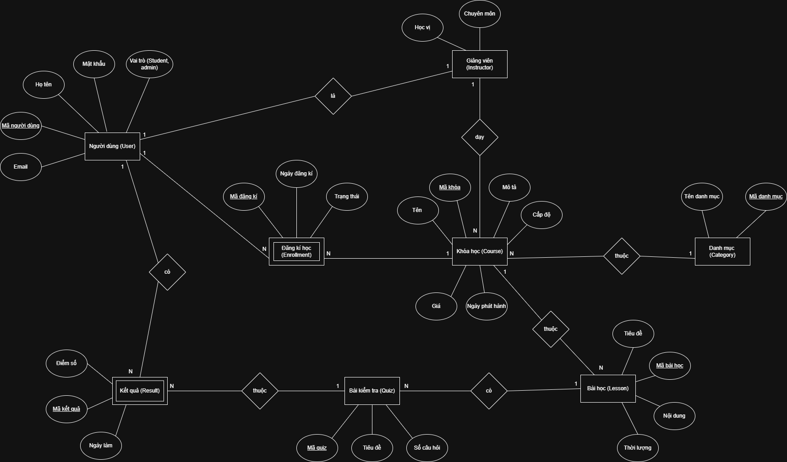

# **Hệ thống Quản lý Đặt phòng Khách sạn**
## **Mô tả**  
***Một nền tảng học trực tuyến (như Coursera hoặc Udemy) cần quản lý:**  

**Người dùng (User):** mã người dùng, họ tên, email, mật khẩu, vai trò (student/instructor/admin)  
**Khóa học (Course):** mã khóa, tên, mô tả, cấp độ, giá, ngày phát hành  
**Danh mục khóa học (Category):** mã danh mục, tên danh mục  
**Giảng viên (Instructor):** là một loại User, có thêm thông tin học vị, chuyên môn  
**Đăng ký học (Enrollment):** lưu việc học viên tham gia khóa học nào, ngày đăng ký, trạng thái (đang học, hoàn thành, hủy)  
**Bài học (Lesson):** mã bài học, tiêu đề, nội dung, thời lượng, thuộc khóa học  
**Bài kiểm tra (Quiz):** mã quiz, tiêu đề, số câu hỏi, thuộc bài học nào  
**Kết quả (Result):** mã kết quả, điểm, ngày làm, thuộc về học viên nào và quiz nào  

### **1. Xác định tất cả thực thể, thuộc tính, khóa chính, khóa ngoại**  
**- Thực thể:** Người dùng (User)   
 **Thuộc tính:** mã người dùng, họ tên, email, mật khẩu, vai trò (student/instructor/admin)  
 - Khóa chính: mã người dùng 

 **- Thực thể:** Khóa học (Course)    
 **Thuộc tính:** mã khóa, tên, mô tả, cấp độ, giá, ngày phát hành   
 - Khóa chính: mã khóa  
 - Khóa ngoại: mã danh mục, mã giảng viên

**- Thực thể:** Danh mục khóa học (Category)    
 **Thuộc tính:** mã danh mục, tên danh mục    
 - Khóa chính: mã danh mục  

**- Thực thể:** Giảng viên (Instructor) - User   
 **Thuộc tính:** mã người dùng, học vị, chuyên môn 
 - Khóa chính: mã giảng viên      

**- Thực thể:** Đăng ký học (Enrollment) - Khóa học  
 **Thuộc tính:** mã đăng kí, ngày đăng ký, trạng thái (đang học, hoàn thành, hủy)  
 - Khóa chính: mã đăng kí   
 - Khóa ngoại: mã người dùng, mã khóa  

**- Thực thể:** Bài học (Lesson)  
 **Thuộc tính:** mã bài học, tiêu đề, nội dung, thời lượng   
 - Khóa chính: mã bài học   
 - Khóa ngoại: mã khóa

**- Thực thể:** Bài kiểm tra (Quiz) - Bài học (Lesson)  
 **Thuộc tính:** mã quiz, tiêu đề, số câu hỏi    
 - Khóa chính: mã quiz  
 - Khóa ngoại: mã bài học  

**- Thực thể:** Kết quả (Result)  
 **Thuộc tính:** mã kết quả, điểm, ngày làm  
 - Khóa chính: mã kết quả  
 - Khóa ngoại: mã người dùng, mã quiz  

### **2. Thể hiện các mối quan hệ chính:**  
a. Một giảng viên có thể dạy nhiều khóa học: Mối quan hệ 1:N  
b. Một khóa học thuộc về một danh mục: Mối quan hệ 1:N  
c. Một khóa học có nhiều bài học, mỗi bài học có thể có quiz:   
- Một khóa học có nhiều bài học: Mối quan hệ 1:N  
- Mỗi bài học có thể có quiz: Mối quan hệ 1:N  

d. Một học viên có thể học nhiều khóa học → mối quan hệ n–n    (Enrollment)  
-> Tạo thực thể trung gian: Đăng ký học (Enrollment)
- Một học viên có nhiều đăng kí: Mối quan hệ 1:N 
- Một khóa học có nhiều đăng kí bởi học viên: Mối quan hệ 1:N  

e. Một học viên có thể làm nhiều quiz, mỗi lần làm có một Result riêng  
-  Một học viên có thể làm nhiều quiz: Mối quan hệ N:N  
-> Tạo thực thể trung gian: Kết quả (Result)
- Một học viên có nhiều kết quả: Mối quan hệ 1:N 
- Một câu hỏi có nhiều kết quả từ nhiều học viên: Mối quan hệ 1:N 

### **3. Vẽ sơ đồ ERD đầy đủ với các ký hiệu:**  
a. (1–n), (n–n)  
b. Khóa chính (PK), khóa ngoại (FK)  
c. Ghi chú vai trò (Student, Instructor nếu chung bảng User)   

   

### **4. (Optional): Đề xuất thêm bảng Payment hoặc Certificate để mở rộng hệ thống**  

