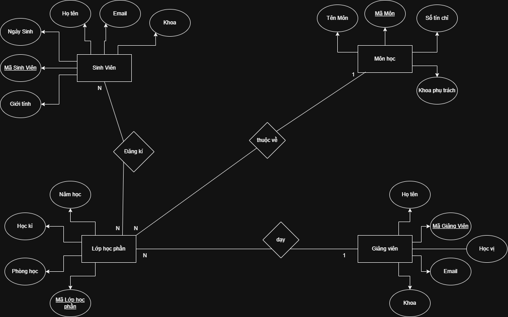

* Mô tả
Một trường đại học cần quản lý việc đăng ký môn học của sinh viên. Hệ thống lưu trữ thông tin như sau:

Sinh viên (Student): mã sinh viên, họ tên, ngày sinh, giới tính, email, khoa  
Môn học (Course): mã môn, tên môn, số tín chỉ, khoa phụ trách  
Giảng viên (Instructor): mã giảng viên, họ tên, học vị, email, khoa  
Lớp học phần (Class_Section): mã lớp học phần, học kỳ, năm học, phòng học  
Đăng ký (Enrollment): ghi lại việc sinh viên đăng ký lớp học phần cụ thể  

1. Xác định các thực thể và thuộc tính chính  
- Thực thể: Sinh viên  
 Thuộc tính: mã sinh viên, họ tên, ngày sinh, giới tính, email, khoa  
- Thực thể: Môn học  
 Thuộc tính: mã môn, tên môn, số tín chỉ, khoa phụ trách  
- Thực thể: Giảng viên  
 Thuộc tính: mã giảng viên, họ tên, học vị, email, khoa  
- Thực thể: Lớp học phần  
 Thuộc tính: mã lớp học phần, học kỳ, năm học, phòng học  

2. Xác định mối quan hệ giữa các thực thể,  
a. Giảng viên dạy lớp học phần nào: Mối quan hệ 1:N  
b. Lớp học phần thuộc về môn học: Mối quan hệ 1:N  
c. Sinh viên đăng ký lớp học phần nào: Mối quan hệ N:N  
d. Sinh viên đăng kí môn học: Mối quan hệ N:N  
e. Giảng viên dạy môn học: Mối quan hệ N:N  

3. Vẽ sơ đồ ERD mô tả đầy đủ các mối quan hệ và ràng buộc (1–n, n–n)

  

4. Chỉ rõ khóa chính, khóa ngoại, và thuộc tính đa trị (nếu có)  
Khóa chính: Mã Sinh Viên, Mã Môn, Mã Giảng viên  
* Lớp học phần:  
- Khóa chính: Mã lớp học phần  
- Khóa ngoại: Mã môn, Mã giảng viên  

